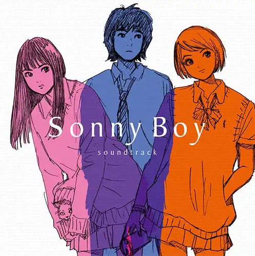

# 🎨 YouTube Thumbnail Style Cloner



---

## 🚀 Overview

**YouTube Thumbnail Style Cloner** is an advanced AI-powered tool designed to analyze, replicate, and generate YouTube thumbnails in the style of any channel you choose. By orchestrating a series of specialized agents, this project enables creators to:

- Scrape and analyze thumbnail styles from successful channels
- Generate new thumbnails that match those styles for their own videos
- Streamline and automate the creative process for YouTube branding

---

## ✨ Features

- **Channel Style Analysis**: Scrapes and deeply analyzes thumbnails from any YouTube channel.
- **Automated Thumbnail Generation**: Produces new thumbnails that faithfully replicate the chosen style, tailored to your video.
- **Multi-Agent Orchestration**: Modular architecture with agents for scraping, analysis, prompt generation, and image creation.
- **Interactive Workflow**: Guides you step by step, collecting all necessary info and ensuring smooth transitions between phases.

---
## 🔐 Environment Variables (`.env`)

To keep your API keys and configuration secure, this project uses a `.env` file.  
**Never commit your `.env` file to public repositories!**

### Example `.env` file

```properties
GOOGLE_GENAI_USE_VERTEXAI=FALSE
GOOGLE_API_KEY=your-google-api-key
OPENAI_API_KEY=your-openai-api-key
YOUTUBE_API_KEY=your-youtube-api-key
```

### Variable Descriptions

- **GOOGLE_GENAI_USE_VERTEXAI**  
  Set to `TRUE` to use Google Vertex AI, or `FALSE` to use the standard Google GenAI API.

- **GOOGLE_API_KEY**  
  Your Google API key for accessing Google GenAI or Vertex AI services.

- **OPENAI_API_KEY**  
  Your OpenAI API key for generating prompts or images using OpenAI models.

- **YOUTUBE_API_KEY**  
  Your YouTube Data API key for scraping thumbnails and channel data.

### How to Set Up

1. **Copy the example file:**  
   If provided, copy `.env.example` to `.env`:
   ```bash
   cp youtube_thumbnail_agent/.env.example youtube_thumbnail_agent/.env
   ```
   Or create a new `.env` file in the `youtube_thumbnail_agent/` directory.

2. **Fill in your API keys:**  
   Replace the placeholder values with your actual API keys.

3. **Keep it secret:**  
   Add `.env` to your `.gitignore` to prevent accidental commits.

### Why use a `.env` file?

- Keeps sensitive information out of your codebase.
- Makes it easy to change configuration without editing source code.
- Supports different settings for development, testing, and production.

---

> **Tip:**  
> If you need new API keys, visit the [Google Cloud Console](https://console.cloud.google.com/), [OpenAI dashboard](https://platform.openai.com/), or [Google Developers Console](https://console.developers.google.com/) for YouTube.

---
## 🛠️ How It Works

### 1. **Channel Selection**

- Specify the YouTube channel whose thumbnail style you want to clone.
- Optionally, highlight particular style elements you like.

### 2. **Thumbnail Collection**

- The scraper agent downloads the latest thumbnails from the channel for reference.

### 3. **Style Analysis**

- The analyzer agent studies these thumbnails in detail, identifying:
  - Color schemes
  - Typography
  - Composition
  - Recurring elements
  - Text and design motifs
- Generates a comprehensive style guide.

### 4. **Video Info Collection**

- The prompt generator agent collects key details about your video:
  - Title, topic, key elements, text to include, and any specific style notes.

### 5. **Thumbnail Generation**

- The image generator agent creates a new thumbnail, matching the analyzed style but unique to your content.

---

## 🧩 Architecture

```
[User Input]
     ↓
[Manager Agent]
     ↓
 ┌────────────┬──────────────┬───────────────┬──────────────┐
 │Prompt Gen. │Image Gen.    │Scraper Agent  │Analyzer Agent│
 └────────────┴──────────────┴───────────────┴──────────────┘
```

- **Manager Agent**: Orchestrates the process, delegating to specialized agents for each phase.
- **Prompt Generator**: Collects video-specific details.
- **Image Generator**: Creates the final thumbnail.
- **Scraper Agent**: Downloads thumbnails from a channel.
- **Analyzer Agent**: Analyzes thumbnails and builds a style guide.

---

## 📦 Installation

1. **Clone the repository:**
   ```bash
   git clone https://github.com/yourusername/ADK-Thumbnail_Generater.git
   cd ADK-Thumbnail_Generater
   ```
2. **Install dependencies:**
   ```bash
   pip install -r requirements.txt
   ```
3. **Set up environment variables:**
   - Copy `.env.example` to `.env` and fill in any required API keys (Google ADK, OpenAI, etc).

---

## 🚦 Usage

1. **Run the main agent:**
   ```bash
   # Example entrypoint (update as needed)
   python -m youtube_thumbnail_agent.agent
   ```
2. **Follow the prompts:**
   - Enter the YouTube channel URL
   - Confirm thumbnail style analysis
   - Provide your video details
   - Receive your custom-generated thumbnail!

---

## 📝 Example Workflow

1. **Select Channel:**
   > Enter the URL of the channel whose style you want to clone.
2. **Scraping:**
   > The agent downloads and prepares thumbnails for analysis.
3. **Style Guide:**
   > The system presents a summary of the channel's style.
4. **Video Details:**
   > You provide your video info and preferences.
5. **Thumbnail Output:**
   > Receive your new thumbnail, ready to upload!

---

## 📁 Project Structure

```
ADK-Thumbnail_Generater/
├── requirements.txt
├── youtube_thumbnail_agent/
│   ├── agent.py                # Manager agent
│   ├── constants.py
│   ├── shared_lib/
│   │   ├── image_utils.py      # Image processing helpers
│   │   └── callbacks.py        # Callback utilities
│   └── sub_agents/
│       ├── generate_image_agent/
│       ├── prompt_generator/
│       ├── thumbnail_analyzer_agent/
│       └── thumbnail_scraper/
└── ...
```

---

## 🧠 Dependencies

- `google-adk==0.4.0`
- `google-generativeai==0.8.5`
- `python-dotenv==1.1.0`
- `openai==1.77.0`
- `requests==2.32.3`

---

## 🤝 Contributing

Pull requests and suggestions are welcome! Please open an issue to discuss major changes first.

---

## 📜 License

This project is licensed under the MIT License.

---

## 🙏 Credits

- AI Orchestration: [Google ADK](https://github.com/google/adk)
- Thumbnail Inspiration: YouTube Creators
- Cover Art: _Sonny Boy Soundtrack_ (for demo purposes)

---

## 💬 Contact

For support or business inquiries, please open an issue or contact the maintainer.

---

> _Happy Creating!_

---
